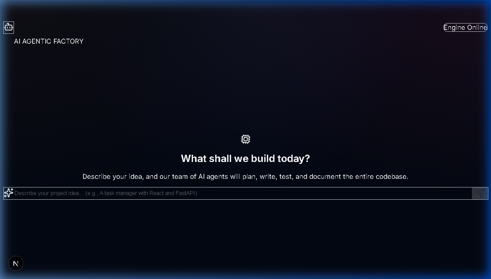
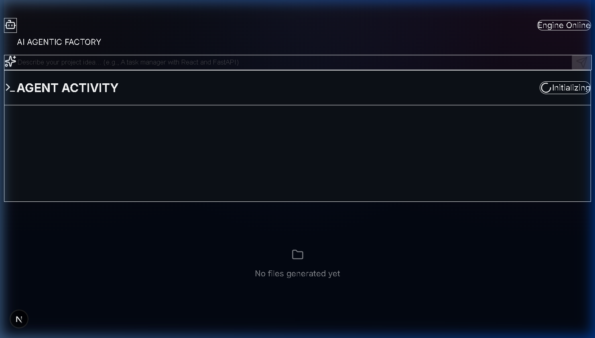
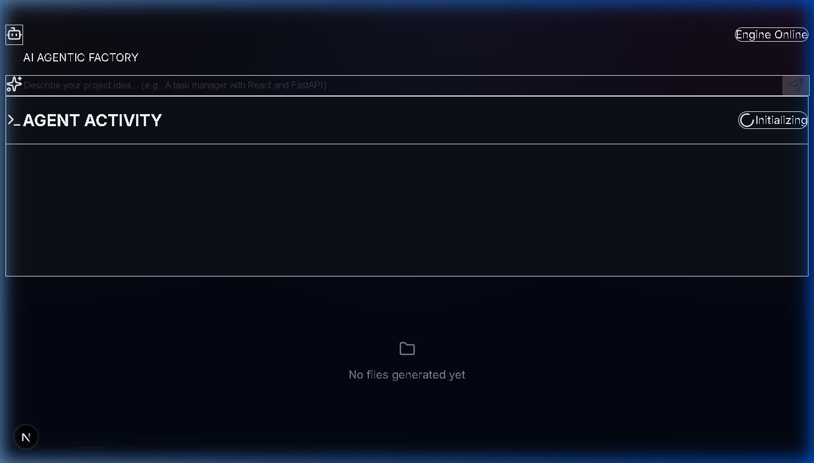

# 🔥 The Forge — AI Agentic Factory

**The Forge** is a cutting-edge, autonomous multi-agent software engineering system designed to transform high-level project ideas into fully functional codebases. Powered by advanced AI agents, it handles planning, architecture, coding, and documentation with minimal human intervention.

## 🚀 Features

- **Autonomous Project Generation**: Describe what you want to build, and our agents will plan and execute the entire development process.
- **Real-time Agent Activity**: Watch the AI agents think, research, and code in real-time through a sleek, dynamic dashboard.
- **Interactive Blueprinting**: Review and approve the project architecture before a single line of code is written.
- **Multi-Agent Orchestration**: Specialized agents (Architect, Developer, Reviewer) work together using LangGraph.
- **Modern Dashboard**: A premium, dark-themed UI built with Next.js and Framer Motion for smooth animations.

## 📸 Screenshots

### 1. Home Page

### 2. Agent Activity

### 3. Project Dashboard

## 🛠️ Technology Stack

- **Backend**: Python, FastAPI, LangGraph, LangChain, Pydantic.
- **Frontend**: Next.js 15+, TypeScript, Tailwind CSS, Framer Motion, Lucide React.
- **AI Models**: Google Gemini (Flash/Pro), OpenAI GPT-4o, Ollama (Local).
- **Architecture**: WebSocket-based real-time communication, State-machine workflow.

## 📖 How to Run

### Backend
1. Navigate to the `backend` directory.
2. Install dependencies: `pip install -r ../requirements.txt`.
3. Configure your `.env` file with API keys.
4. Run the server: `python main.py`.

### Frontend
1. Navigate to the `frontend` directory.
2. Install dependencies: `npm install`.
3. Start the development server: `npm run dev`.
4. Open `http://localhost:3000` in your browser.

## 🌐 Languages Used
- **Python**: Core agent logic and backend API.
- **TypeScript/JavaScript**: Interactive frontend.
- **CSS (Tailwind)**: Modern, responsive styling.
- **Markdown**: Documentation and project blueprints.

---
Created with ❤️ by Maamoun's AI Assistant.
